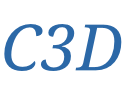

# C3D

  

> Learning Spatiotemporal Features with 3D Convolutional Network

## 内容列表

- [C3D](#c3d)
  - [内容列表](#内容列表)
  - [背景](#背景)
  - [主要维护人员](#主要维护人员)
  - [参与贡献方式](#参与贡献方式)
  - [许可证](#许可证)

## 背景

## 主要维护人员

* zhujian - *Initial work* - [zjykzj](https://github.com/zjykzj)

## 参与贡献方式

欢迎任何人的参与！打开[issue](https://github.com/zjykzj/C3D/issues)或提交合并请求。

注意:

* `GIT`提交，请遵守[Conventional Commits](https://www.conventionalcommits.org/en/v1.0.0-beta.4/)规范
* 语义版本化，请遵守[Semantic Versioning 2.0.0](https://semver.org)规范
* `README`编写，请遵守[standard-readme](https://github.com/RichardLitt/standard-readme)规范

## 许可证

[Apache License 2.0](LICENSE) © 2020 zjykzj